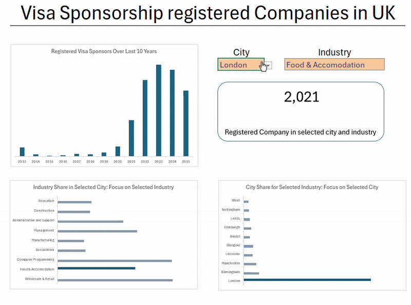

# UK Visa Sponsorship Dashboard

## Overview

This project presents an interactive Excel dashboard designed to help international students and professionals identify key opportunities for visa sponsorship in the UK. Leveraging a robust dataset of over 120,000 registered sponsor companies, this dashboard provides dynamic insights into industry distribution, geographical hotspots, and historical trends of sponsorship licenses.

The primary mission of this dashboard is to empower individuals seeking sponsored employment by transforming raw data into actionable intelligence, making the complex UK job market more navigable.

## Features & Key Insights

This dashboard offers several interactive features to explore the visa sponsorship landscape:

1.  **Historical Sponsorship Trends:**
    * **Chart:** Displays the **Number of Registered Visa Sponsorship Companies Over the Last 10 Years**, dynamically filtered by user-selected City and Industry. This helps in understanding long-term growth patterns and recent changes.

2.  **Dynamic Industry Analysis:**
    * **Chart:** When a **City** is selected from the dropdown, this chart highlights the **count of companies in the selected Industry among other sectors within that specific City**. It provides a granular view of industry concentration in a chosen location.

3.  **Dynamic Geographical Analysis:**
    * **Chart:** When an **Industry** is selected from the dropdown, this chart highlights the **count of companies in the selected City among other cities within that specific Industry**. This helps pinpoint geographical strongholds for a particular sector.

4.  **Comprehensive Data View:**
    * Access to detailed information for each company, including:
        * Company Name
        * License Grant Date
        * Primary Industry
        * Town/City
        * Website Address
        * LinkedIn Page Address

## Data Source

The dataset underpinning this dashboard comprises **over 120,000 records** of visa sponsorship registered companies. This data was meticulously extracted from a private API, overcoming challenges such as pagination and API rate-limiting (e.g., 429 "Too Many Requests" errors) using Python's `requests` library.

## Tools & Technologies Used

This project showcases proficiency in a range of data analytics and visualization tools:

* **Microsoft Excel:** The primary platform for dashboard creation.
* **Power Query:** Utilized for robust data extraction, cleaning, transformation (e.g., parsing dates, standardizing text, creating boolean flags for contact info availability), and loading the 120,000+ records.
* **Power Pivot (Data Model):** Employed for creating a scalable and efficient data model, managing relationships, and ensuring high performance with large datasets.
* **DAX (Data Analysis Expressions):** Used for creating complex measures and calculated columns that power the dynamic charts and interactive filters, allowing for intricate aggregations and time-intelligence calculations.
* **Python:** Essential for the initial data extraction process from the private API, handling pagination, and managing HTTP requests and JSON parsing.

## How to Use the Dashboard

1.  **Download:** Clone or download this repository to your local machine.
2.  **Open:** Open the `uk_sponsor_companies_dashboard.xlsx` file in Microsoft Excel.
3.  **Enable Content:** If prompted, enable macros/content to ensure full functionality.
4.  **Interact:** Use the dropdown menus (Data Validation cells) for **'Select City'** and **'Select Industry'** to dynamically filter the charts and observe real-time insights.

## Future Enhancements

Potential future enhancements for this project include:

* Integration with external data sources (e.g., job posting data, economic indicators) for richer analysis.
* Further refining contact information extraction and validation.
* Exploring advanced DAX measures for more complex comparative analysis.

## Contact

For any questions, feedback, or collaborations, feel free to reach out:

* **LinkedIn:** [https://www.linkedin.com/in/dbrnjd/]
* **GitHub:** [https://github.com/dbrnjd]

